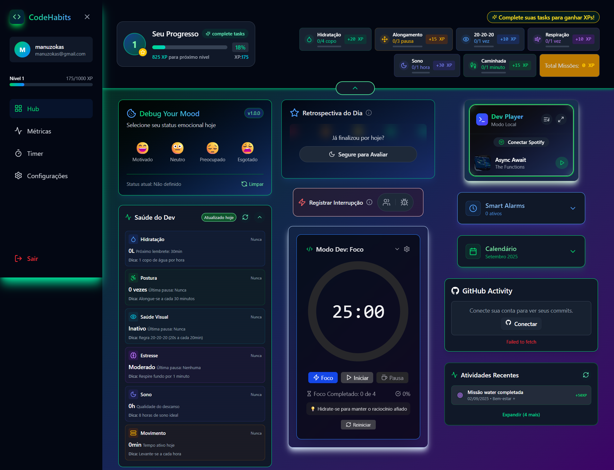

# CODE HABITS TCC

Este é o projeto do meu Trabalho de Conclusão de Curso (TCC) em desenvolvimento (ainda em andamento), de um dashboard pessoal e ferramenta de produtividade desenvolvida para ajudar o usuário a monitorar e gerenciar sua atividade digital em um único lugar.

---

## Objetivo Principal

Através de um hub central, com widgets de gerenciamento de rotina dev, os dados de rotina serão coletados e posteriormente cruzados com outros dados para criar indicadores de produtividade e gerar insights. O Code Habits exibirá isso em uma página de dashboard, com as métricas de saúde,  os gráficos de produtividade e prevenção burnout.

### 🚀 Tecnologias Utilizadas

Este projeto utiliza uma arquitetura de pilha completa (full-stack), com as seguintes tecnologias:

**Front-end:**
-   **React:** Biblioteca para construção da interface de usuário.
-   **Vite:** Ferramenta de build otimizada para desenvolvimento rápido.
-   **TypeScript:** Linguagem para tipagem estática e segurança do código.
-   **Tailwind CSS:** Framework de CSS utilitário para design responsivo e rápido.

**Back-end:**
-   **Node.js (Embutido):** Um servidor back-end leve, rodando no mesmo projeto (nono-repo), para orquestrar as chamadas de API e proteger as chaves de acesso.

**Banco de Dados & Autenticação:**
-   **Supabase/PostgresSQL:** Utilizando um Baas (Backend as a Service) como nosso banco de dados.

**Integrações de API:**
-   **GitHub API:** Para rastrear e exibir a atividade diária de commits.
-   **Spotify API:** Para controle de mídia e exibição do que está sendo reproduzido.

---

### ✨ Funcionalidades Atuais

-   **Widgets de Rotina Dev:** Alarme, Calendário, Registro de Mood, Timer, Registro de Interrupções, Métricas de Saúde Dev, Avaliação de Feedback de Produtividade pós Expediente e etc...
-   **Autenticação com Supabase:** Gerenciamento seguro de usuários.
-   **GitHub Activity Widget:** Um widget que exibe o número de commits diários, com a opção de ver os commits recentes. Cada item é clicável e redireciona para o commit no GitHub.
-   **Integração com o Spotify:** [Adicione mais detalhes sobre a funcionalidade do Spotify se houver]

---

### 🛠️ Como Rodar o Projeto

Para configurar e rodar o projeto localmente, siga os passos abaixo.

#### Pré-requisitos

Certifique-se de ter instalado em sua máquina:
-   [Node.js](https://nodejs.org/en/) (versão 18 ou superior)
-   [npm](https://www.npmjs.com/)
-   [ngrok](https://ngrok.com/) para expor seu servidor local à internet, o que é necessário para os callbacks das APIs.

#### Configuração

1.  **Instale as dependências do projeto:**
    ```bash
    npm install
    ```

2.  **Configure o ambiente:**
    Crie um arquivo `.env` na raiz do projeto com as chaves das suas APIs. O projeto espera as seguintes variáveis de ambiente:
    -   `VITE_SUPABASE_URL`
    -   `VITE_SUPABASE_ANON_KEY`
    -   `GITHUB_CLIENT_ID`
    -   `GITHUB_CLIENT_SECRET`
    -   `GITHUB_CALLBACK_URL`
    -   `SPOTIFY_CLIENT_ID`
    -   `SPOTIFY_CLIENT_SECRET`
    -   `SPOTIFY_REDIRECT_URI`
    -   [E outras que você julgar necessárias]

3.  **Inicie o ngrok e atualize as URLs:**
    Abra um terminal e inicie o ngrok para o seu backend:
    ```bash
    ngrok http 4000
    ```
    Copie a URL pública gerada pelo ngrok e use-a para atualizar as variáveis `GITHUB_CALLBACK_URL` e `SPOTIFY_REDIRECT_URI` no seu arquivo `.env` e também nos dashboards das APIs do GitHub e do Spotify.

4.  **Inicie o servidor back-end:**
    Em um novo terminal, inicie o servidor Node.js que se comunica com as APIs:
    ```bash
    node index.js
    ```

5.  **Inicie a aplicação front-end:**
    Em outro terminal, inicie a aplicação React/Vite:
    ```bash
    npm run dev
    ```

Sua aplicação estará rodando em `http://localhost:5173`, pronta para uso.

## 📸 Demonstração das Telas Principais

<p align="center">
  
</p>

<p align="center">
  
</p>
